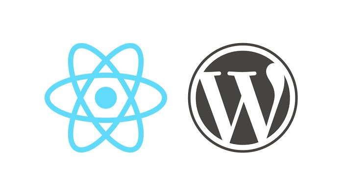

# React Wordpress Theme

[]()


This is the basic skeleton wordpress theme build with react.js. 
This theme support all wordpress feature like custom logo, banner, backgournd color and image, custom post type, custom taxonomy, categories, tags, as menu, and widget and side bar as you want with rest api. So you can build native mobile apps. All backend services are included with theme. No plugin is required for these theme.


# Routes

Just place the following url after homepage url;

Like: https://yoursite.com/wp-json/wp/v2/posts to get all the posts in json format.

You can also replace /wp-json/ with /index.php?rest_route=/ this mandatory some web server configuation. Always try to use second format because it is universal.


| Resources | Routes | Method | Comments |
| ------ | ------ | ------ | ------ | 
| All Post | [/wp-json/wp/v2/posts]() | get | 
| Single Post | [/wp-json/wp/v2/posts/post_id]() | get |
| All Pages | [/wp-json/wp/v2/pages]() | get | |
| Single Page | [/wp-json/wp/v2/pages/page_id]() | get |
| Category List | [/wp-json/wp/v2/categories]() | get |
| Single Category | [/wp-json/wp/v2/categories/category_id]() | get |
| Menu List | [/wp-json/wp/v2/menus]() | get |
| Menu Location List | [/wp-json/wp/v2/locations]() | get | 
| Menu Items | [/wp-json/wp/v2/menus/menu_name]() | get | menu items | 
| Menu Items | [/wp-json/wp/v2/menus/menu_slug]() | get | menu items | 
| Menu Items | [/wp-json/wp/v2/locations/menu_location_name]() | get | menu items | 
| Widget List | [/wp-json/wp/v2/widgets]() | get |
| Widget Contents | [/wp-json/wp/v2/widgets/widget_id]() | get |
| Sidebar List | [/wp-json/wp/v2/sidebars]() | get |
| Sidebar Contents | [/wp-json/wp/v2/sidebars/sidebar_name]() | get |
| Comments | [/wp-json/wp/v2/comments]() | get |
| Comment Contents | [/wp-json/wp/v2/comments/comment_id]() | get |

# Technology used

* [wordpress](https://wordpress.org) - It is a wordpress theme.
* [react](https://reactjs.org) - awesome javascript framework
* [node.js](https://nodejs.org)  - manage building tools like npm
* [laravel.mix.js](https://laravel-mix.com/) - compile and minify the resource files.

# Setup
Install wordpress in your local computer. keep these files in a folder inside your theme directory. Active the theme from wordpress admin pannel.
That's ok.
Visit your site with browser.


# Develop.

## First run this command (Ensure that you have installed node and npm in your pc).

```sh
$ npm install
```

# Run one of the following command to build.
## Development mood 
```sh
$ npm run dev
$ npm run watch
```
## Prouction mood
```sh
$ npm run production
```

The file /resources/js/app.js and /resources/scss/app.scss is your entry point. 

Your js files will be compiled to /assets/js/app.js and scss files to /assets/css/app.css that's already linked up to index.php.
And static image folder inside resources will be copied to assets folder automaticaly.

So start coding and build someting awesome.
